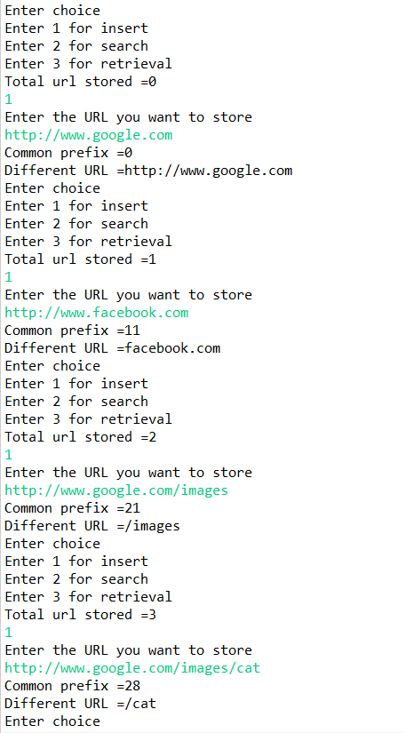
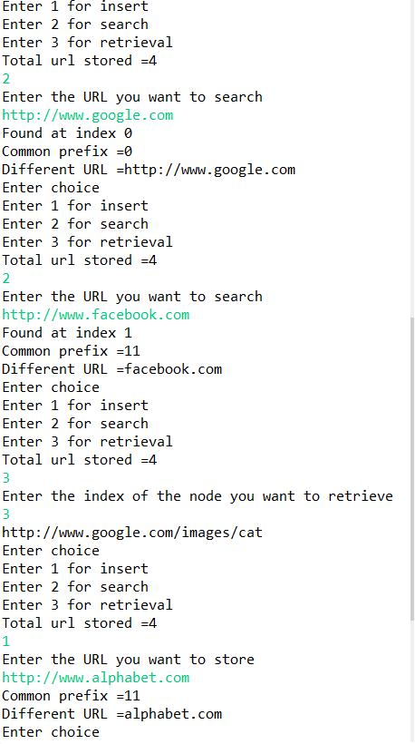
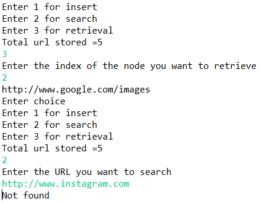

# Implementing AVL tree for URL Compression
## Problem Statement
URLs are generally stored in a database with a unique id. If we store the URL in hard disk as
it is then it will result in slow performance and also, a huge storage requirement. To
overcome this circumstance, a compression method to reduce the URLs size is required. So
our goal here is to compress the URLs such that they occupy less space and can be stored in
RAM for quick access.
## Output
  
  
  
## Time Complexity
### Retrieval
Time complexity for retrieval operation in an AVL tree is O(h) where h is the height of the
tree. The heigth of an AVL tree is logN where N is the number of nodes in the tree, hence
the time complexity for retrieval operation is O(logN).
### Insertion
Retrieval operation is performed at each step of insertion, for retrieval the time complexity is
O(logN) hence time complexity for insertion is O(log(logN)) where N is the number of nodes
in the AVL tree.
Hence insertion takes more time for a higher number of N as compared to retrieval
### Search
The worst case scenario for search operation will be the height of the tree, which is O(logN),
hence time complexity for search operation is O(logN) where N is the number of nodes in the
tree.
## Limitations
Since the height has to be maintained in AVL trees frequent rotations are done which inturn
will increase the pointer overhead which even tends to some negligible extra space for very
big inputs.
## Further enhancements
To approach for increasing the reduction of url size above 50% .
Transformation of the input prior to storing i.e. URL shortening can be used to avoid large
data storage problems.
Nowadays AVL trees are not used for URL compression, instead URL shortening tools are
used. URL shortening is a technique on the World Wide Web in which a URLmay be made
substantially shorter and still direct to the required page. This is achieved by using a redirect
which links to the web page that has a long URL.
For example, the URL "https://example.com/assets/category_B/subcategory_C/Foo/" can be
shortened to "https://example.com/Foo", and the URL
"https://en.wikipedia.org/wiki/URL_shortening" can be shortened to "https://w.wiki/U".
Often the redirect domain name is shorter than the original one.
